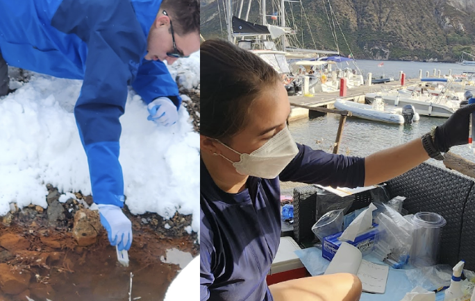
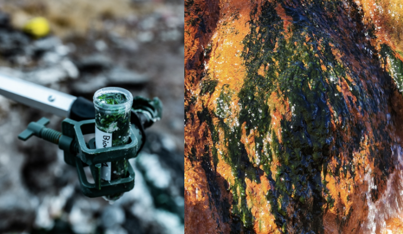
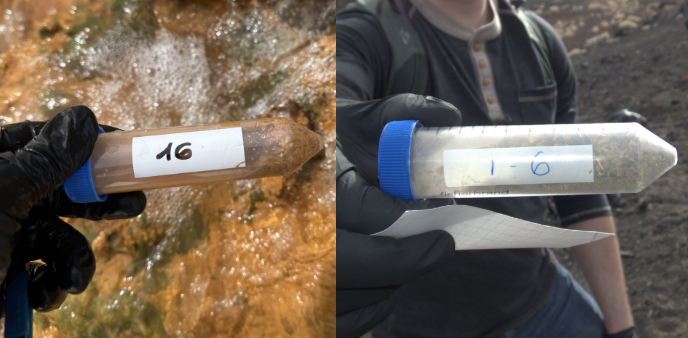
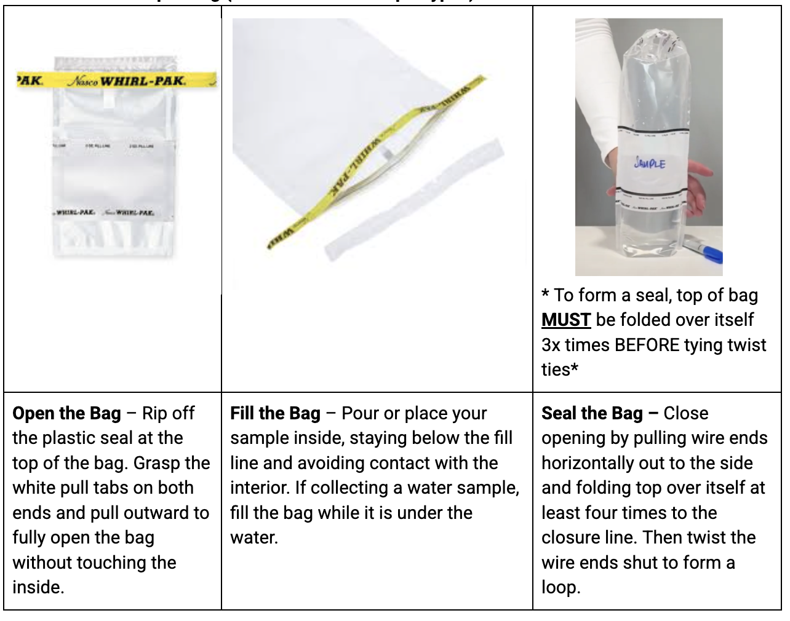

# Sample Collection

## Background
This section outlines general guidelines and protocols for collecting environmental samples, including considerations for different sample types and environments, as well as key steps for ensuring sample integrity and suitability for downstream processing. All sampling must follow the relevant collection protocol for the sample type and environment, whether terrestrial or SCUBA diving.

### Sampling teams and roles
We recommend working in sampling teams at all times, allocating specific tasks (e.g., metadata  collection, sample tracking, [sample collection](06-sample-collection.md)) to different individuals. Teams of two or three seem to work the best. A single individual attempting to manage the entire sampling workflow, from site surveying to metadata collection, is both potentially unsafe and also quite inefficient.

#### We recommend assigning the following tasks across your team:
1. #### Sampling lead
  - The individual with the final say over where a sample will be collected (i.e., the person who picks a spring or a vent or other location to work at). While these decisions will usually be done by group consensus, we find, especially in situations where communication is more difficult (e.g., underwater), having a single person who can indicate “yes or no” to a given location is effective. This person also tracks timing and decides when to end sampling. This role can be separated depending on expertise (e.g., there could be a water sampling lead or a sediment sampling lead).

2. #### Metadata collection
  - An individual who is responsible for ensuring the field metadata is complete. This person should confirm that each sample is linked to a specific field ID, the field ID is readable on the collection device.

3. #### Sample-specific collectors
  - We recommend having different individuals responsible for collecting different kinds of samples. One person for water, one person for sediment/biomass, etc.

4. #### Sample keeper
  - This role is responsible for holding all collected samples and for ensuring the samples make it from the site to being checked-in in the lab. Usually appropriate to also be the metadata collector.

5. #### Geochemistry
  - This role is responsible for collecting geochemistry-specific metadata at a given site.

*Additional roles include safety officer, sample photographer, and additional site-metadata collectors (e.g., the individual responsible for taking geochemistry or other data relevant to an entire site.*

### Sample types

#### Water samples
Water refers to liquid material that has accumulated on the Earth’s surface or within subsurface aquifers (i.e., groundwater). Sources include—but are not limited to—rivers, lakes, oceans, ponds, streams, springs, estuaries, wetlands, glacial meltwater, and geothermal pools.

**Relevance:** Water can serve as a medium for suspended microorganisms (planktonic bacteria, archaea, protists, and viruses), dissolved nutrients, organic matter, and chemical signatures.

**Sampling considerations:** Collect at representative depths and locations to capture environmental variability (e.g., surface vs. bottom water, upstream vs. downstream). Avoid introducing contamination from the sampler’s hands, gear, or nearby sediments. When possible, record water temperature, salinity, pH, dissolved oxygen, and turbidity alongside sample collection.

**Special cases:** In thermally active, hypersaline, or chemically stratified waters, microbial communities may shift dramatically within centimeters of depth, making depth-specific sampling essential.

#### Biomass samples

Biomass is a multi-layered, cohesive community of microorganisms, (e.g., bacteria, archaea and eukaryotes), that grow on surfaces in various environments. These mats are often structured in layers, with different microbial groups occupying distinct strata based on their metabolic functions and environmental conditions.

 *You can identify biomass by:*
  - **Color & Texture:** Look for filamentous, slimy, oily or mat-like growths on rocks, soil or surfaces of sediment. Some biofilms form a thick crust and have brittle surfaces. Common colors are green, brown, black, orange or even pink.
  - **Bubble formation:** A surface with bubbles, froth or foam can indicate certain types of bacteria, indicating the production of gas.
  - **Smell:** Some biofilms, especially in anaerobic environments (lacking oxygen/air), may produce a sulfuric or musty smell.

**Special cases:**
- **Layered Communities:** Some microbial mats are stratified with sharp physical and chemical gradients (e.g., light, oxygen, sulfide). Removing or disturbing deeper layers can change their chemistry within minutes, altering the community structure before analysis.
- **Fragile or Unstable Mats**: Gelatinous or loosely attached biomass can disintegrate with minimal disturbance. Use minimal water movement and gentle collection tools (spatulas, syringes) to avoid loss of material.
- **Mineral-Crusted Mats:** Some mats, especially in iron- or carbonate-rich environments, are cemented with minerals. These require careful scraping to collect without shattering the structure.
- **Hydrothermal & High-Temperature Mats:** Thermophilic biomass may degrade rapidly once removed from high temperatures. Collect carefully and preserve immediately.
- **Anoxic Biomass:** Anaerobic mats can oxidize quickly on exposure to air, altering color, chemistry, and microbial activity. If anaerobic conditions are relevant to your study, collect into oxygen-free containers or preserve promptly.
- **Episodic Growth Mats:** Some mats form only seasonally or after specific events (e.g., flooding, algal blooms). Document environmental context so the temporal dynamics are clear.

#### Minimizing Disturbance to Biofilms and Biomass
  - When sampling microbial mats, biofilms, or other cohesive biomass, avoid removing the entire growth from a given patch.
  - Target the active surface layer (top 1–5 mm) rather than the full mat depth unless deep layers are specifically needed for the research question.
  - Collect from the edges or a small subsection of the biomass, leaving most of the mat intact to continue ecological function.
  - For spatially extensive mats, collect from multiple points in low-traffic areas rather than concentrating disturbance in one spot.
  - Avoid dislodging or fragmenting surrounding substrate, as this can cause biomass detachment beyond the sampled area.
  - Record in metadata whether sampling was partial or complete, and document the approximate percent of biomass removed.
  - This approach preserves microbial community structure for long-term monitoring, minimizes habitat impact, and supports repeat sampling at the same location.

#### Sediment/Soil samples
Sediment is insoluble material—such as mineral particles, organic debris, and chemical precipitates—deposited by water, wind, or ice. In aquatic environments, sediment may be soft (mud, silt) or consolidated (sand, gravel), and can contain unique microbial communities adapted to low-oxygen or anoxic conditions. 

Soil is the biologically active upper layer of the Earth’s surface, composed of mineral particles, decomposed organic matter, air, and water. Soil supports plant growth and sustains complex microbial networks that drive nutrient cycling.

**Sampling considerations:** Avoid mixing layers unless the study requires homogenization—microbial communities vary significantly by depth. For fine-scale studies, note soil/sediment texture, color, moisture, and odor. Use sterilized tools to avoid contamination, and record GPS coordinates, depth, and environmental conditions.

**Special cases:** Organic-rich soils, hydrothermal sediments, or chemically active soils (e.g., high sulfur, iron, or salinity) may host specialized extremophiles of interest for environmental microbiology.

### Sampling order
1.  Water Samples
2. Sediment/soil
3. Biomass

*Extra samples may be collected after planned ones.*

This order is to minimize contamination between sample types (e.g., avoiding mixing sediment into a water sample if both are collected from the same area). *It is most relevant for underwater sampling.*

## Protocols

### Pre-Collection:

1. Pre-load sample bag with all requisite equipment, complete final gear checks.
2. Travel to site
3. Prepare a collection team by providing collection bags and assigning roles.
    - Sync dive computers and prep pH sensors.
4. Survey the area for immediate hazards such as:
    - Unstable terrain or rocks (terrestrial, shore-entry)
    - Slippery surfaces, sharp debris (terrestrial, shore-entry
    - Steep drop-offs or wave exposure (terrestrial, shore-entry
    - Signs of wildlife (e.g., snakes, wasps, sea urchins) (terrestrial, SCUBA)

### Site Metadata

#### Site Documentation  (To be measured once per sampling area)
**Collect the following images of the site** 
1. Overview Image: One image of the site without people.
2. Sampling Activity Image: At least one image of yourself or team sampling.
3. Sample Detail Images: Take additional photos of sample sites with a ruler,  scale card, or other measurable reference object

**GPS Coordinates**
1. Choose a device for GPS collection and note in the metadata (e.g., Handheld GPS, Smartphone).
2. Select scientific format to be in decimal degrees (DD) (e.g., 42.3601, -71.0589) and use World Geodetic System, 1984 (WGS 84) for recording.
3. Record horizontal accuracy (in meters) to assist with spatial analysis (plus/minus 3m)

**For each GPS point, collect:**
- Date & Time (in time zone of site)
- Collector Name or Initials
- Device used
- Coordinate format and datum
- Environment notes (e.g., location, GPS signal quality)
- Take a photo of the GPS point and cross-check with a second device if time permits.

#### Water/Site Chemistry (To be measured once per sampling area)
If using a 25ml conical for geochemistry measurements, you may reuse that tube between sites, however ensure it is rinsed with DI water between each location

#### Measure and record pH

- **For water samples:** Use pH strips. Dip the strip in the water (either in a clean conical tube or directly in the source), remove, and wait 30 seconds before reading. Photograph the strip alongside the color reference on the pH strip container. Do not use the TDS sensor for pH measurements, as this requires separate calibration buffers.
- **For mud or sediment samples:** Mud or sediment may obscure pH strip colors, prepare a slurry by mixing approximately 1 part mud/sediment with 10 parts DI water in a clean container. Shake gently for 5 seconds, then let settle briefly. Dip the pH strip into the slurry, wait 30 seconds, and photograph as above. Note: This method provides a standardized slurry pH for comparative purposes and may differ from true in situ pH.
- **Record observed pH in the metadata sheet in 0.5-unit increment**

#### Measure and record salinity
- Remove the cap from the salinity/total dissolved solids (TDS) sensor. Power on, confirm units are in ppm, and ensure the device is set to measure salt. Hold the probe in the water sample (either in a clean conical tube or directly in the source) until the reading stabilizes. Record the value in the metadata sheet.
- For sediment or solid samples: Prepare a slurry at approximately 1:10 ratio in DI water and measure as above.
- Rinse and wash the probe tip after each measurement

#### Measure and record temperature
- Use the thermometer to measure water temperature directly from the source. If no water is available, record ambient air temperature at the site. Record in Celsius.

#### Measure and record additional geochemistry
- Remove one aquarium/water quality test strip from the provided container. Follow the same sampling approach as for pH measurement.
- Record any other observations in the metadata sheet, including UV fluorescence, turbidity, odor, and sediment characteristics.

#### Record timing information
- Record the timestamp of the last photograph taken during metadata collection for this location.
- Note any additional relevant site observations in the metadata sheet.

### Water Collection

  

#### Underwater (SCUBA diving)
**Prep:**

1. Put on gloves. Wear gloves while handling the sample.
2. Remove one 1 Liter Whirl-Pak bag (pre-labeled) per sample.
    - Confirm the bag is sealed and undamaged and Field-ID label is intact.
3. Unfold the tabs of the Whirl-Pak without touching the interior or seal area. Use a new bag for each new sample, do not reuse.

**Sampling:**

4. At desired depth, open the bag underwater.
5. Let the water fill naturally (approximately 30 seconds)
6. Close the bag underwater using the appropriate rotating method and twist the wires at least three times.
7. Place in a mesh bag until return to the surface.
8. Once at the surface, place the sample on ice and out of direct sunlight. Inspect the bag for leaks and confirm it is sealed to avoid surface contamination. Always stand the bag upright.

#### Terrestrial
**Prep:**
1. Put on gloves. Wear gloves while handling the sample.
2. Remove one 1 Liter Whirl-Pak bag (pre-labeled) per sample.
3. Confirm the bag is sealed and undamaged.
4. Unfold the tabs of the Whirl-Pak without touching the interior or seal area. Use a new bag for each new sample, do not reuse.

**Sampling:**

5. Submerge the open end of the bag into the water to the desired depth. (Avoid submerging your ungloved arm/hand)
6. Avoid surface scum, dense vegetation or floating debris unless part of the sample.
7. Let the water fill passively, facing upstreams (if there is a current) or away from your body.

**Seal**

8. Once approximately 1 liter has been collected, grasp the tabs and slowly withdraw the bag from the water.
9. Expel the excess air and then twist the top at least 3 times. Remove as much air as possible, spilling some off the sides is acceptable but avoid major sample loss.
10. Bend the ends of the wire tabs together to close securely.
11. Place the sample on ice and out of direct sunlight. Inspect the bag for leaks and confirm it is sealed to avoid contamination. Always stand the bag upright.

### Sediment Collection

#### Underwater (SCUBA diving)
**Prep:**

1. Put on gloves. Wear gloves while handling the sample.
2. Remove one 4oz Whirl-Pak bag (pre-labeled) per sample.
3. Confirm the bag is sealed and undamaged.
4. Approach the sediment site slowly to avoid disturbing the area.
5. Unfold the tabs of the Whirl-Pak without touching the interior or seal area. Use a new bag for each new sample, do not reuse.

**Sampling:**

6. At the site, use a clean scoop or tube to collect the surface sediment (top 1-3 centimeters).
7. Open the whirl pak, and transfer the sample into the bag.
8. Add adjacent water into the bag until the contents are approximately 75% sediment and 25% water (~15mL of liquid).
    - Avoid vegetation, detritus or macroorganisms.
9. Carefully twist (3 times) and close the bag underwater.
10. Place in a mesh bag until return to the surface.
11. Once at the surface, place the sample on ice and out of direct sunlight. Inspect the bag for leaks and confirm it is sealed to avoid surface contamination. Always stand the bag upright.
    
**Notes:**

    - Do not overfill, allow space to twist the bag closed and reduce leakage risk.
    - Change gloves when needed. Avoid handling samples without gloves.

#### Terrestrial
**Prep:**

1. Put on gloves. Wear gloves while handling the sample.
2. Remove one 4oz Whirl-Pak bag (pre-labeled) per sample.
3. Confirm the bag is sealed and undamaged.
4. Identify the sampling point, and avoid areas with large detritus, roots, or debris.
5. Use a sterile scoop or tube to collect the sample.
6. Unfold the tabs of the Whirl-Pak without touching the interior or seal area. Use a new bag for each new sample, do not reuse.

**Sampling:**

7. Use the scoop or tube to collect the sample at the top 1-3 centimeters. (Avoid submerging your ungloved arm/hand)
    - Avoid surface scum, dense vegetation or floating debris unless part of the sample.
8. Transfer sediment into pre-labeled Whirl-pak bag until the contents are approximately 75% sediment and 25% water (~15mL of liquid). Add more adjacent water if needed.

**Seal**

9. Once filled, grasp the tabs, expel the excess air and then twist the top at least 3 times. Remove as much air as possible, spilling some off the sides is acceptable but avoid major sample loss.
10. Bend the ends of the wire tabs together to close securely.
11. Place the sample on ice and out of direct sunlight. Inspect the bag for leaks and confirm it is sealed to avoid contamination. Always stand the bag upright.

### Biomass Collection

#### Underwater (SCUBA diving)

**Prep (before diving):**

1. Put on gloves. Wear gloves while handling the sample.
2. Remove one 4oz Whirl-Pak bag (pre-labeled) per sample.
3. Confirm the bag is sealed and undamaged.
4. Approach the biomass site slowly to avoid disturbing the area. Especially if the biomass is fragile or sensitive to oxidation.
5. Unfold the tabs of the Whirl-Pak without touching the interior or seal area. Use a new bag for each new sample, do not reuse.

**Sampling (during dive):**

6. At the site, use a clean scoop or tweezer to collect the biomass (top 1-5mm).
7. Open the Whirl-pak, and transfer the sample into the bag.
8. Add adjacent water into the bag just enough to cover the biomass but not to dilute it (to reduce oxygen exposure and create a slurry).
    - Avoid vegetation, detritus or macroorganisms.
    - Aim for 15mL of slurry.
9. Carefully twist (3 times at least) and close the bag underwater. Squeeze out excess water if needed.
10. Place in a mesh bag until return to the surface.
11. Once at the surface, place the sample on ice and out of direct sunlight. Inspect the bag for leaks and confirm it is sealed to avoid surface contamination. Always stand the bag upright.

**Notes:** 

    - Do not overfill, allow space to twist the bag closed and reduce leakage risk.
    - Change gloves when needed. Avoid handling samples without gloves.

#### Terrestrial
**Prep:**

1. Put on gloves. Wear gloves while handling the sample.
2. Remove one 4oz Whirl-Pak bag (pre-labeled) per sample.
3. Confirm the bag is sealed and undamaged.
4. Identify the sampling point, and avoid areas with large detritus, roots, or debris.
5. Approach the biomass site slowly to avoid disturbing the area. Especially if the biomass is fragile or sensitive to oxidation.
6. Use a sterile scoop or tweezer.
7. Unfold the tabs of the Whirl-Pak without touching the interior or seal area. Use a new bag for each new sample, do not reuse.

**Sampling:**

8. Use the scoop or tube to collect the sample at the top 1-5mm active layers.
    - Avoid excess soil, surface scum, dense vegetation or floating debris unless part of the sample.
9. Open the Whirl-pak, and transfer the sample into the bag.
10. Add adjacent water into the bag just enough to cover the biomass but not to dilute it (to reduce oxygen exposure and create a slurry).
    - Avoid vegetation, detritus or macroorganisms.
    - Aim for 15mL of slurry.

**Seal**

11. Once filled, grasp the tabs, expel the excess air and then twist the top at least 3 times. Remove as much air as possible, spilling some off the sides is acceptable but avoid major sample loss.
12. Bend the ends of the wire tabs together to close securely.
13. Place the sample on ice and out of direct sunlight. Inspect the bag for leaks and confirm it is sealed to avoid contamination. Always stand the bag upright.
    
### Soil Collection

#### Terrestrial

**Prep:**

1. Put on gloves. Wear gloves while handling the sample.
2. Remove one 4oz Whirl-Pak bag (pre-labeled) per sample.
3. Confirm the bag is sealed and undamaged.
4. Identify the sampling point, and avoid areas with large detritus, roots, feces or debris.
5. Use a sterile scoop, coring device or tube to collect the sample.
6. Unfold the tabs of the Whirl-Pak without touching the interior or seal area. Use a new bag for each new sample, do not reuse.

**Sampling:**

7. Use the scoop or tube to collect the sample at the top 1-3 centimeters. (Avoid submerging your ungloved arm/hand)
8. Transfer soil into a pre-labeled Whirl-pak bag until the contents are approximately 75% soil.
9. If water is nearby, add adjacent water until Whirl-pak is 75% soil and 25% water (15mL), enough to make a slurry.
10. Add more liquid to fully mix but do not over-dilute.

**Seal**

11. Once filled, grasp the tabs, hold upright, shake and expel the excess air. Then twist the top at least 3 times. Remove as much air as possible, spilling some off the sides is acceptable but avoid major sample loss.
12. Bend the ends of the wire tabs together to close securely.
13. Place the sample on ice and out of direct sunlight. Inspect the bag for leaks and confirm it is sealed to avoid contamination. Always stand the bag upright.

### Coral Collection

#### Underwater (SCUBA diving)

**Prep:**

1. Put on gloves. Wear gloves while handling the sample.
2. Remove one 4oz Whirl-Pak bag (pre-labeled) per sample.
3. Confirm the bag is sealed and undamaged.
4. Approach the coral but do not touch until sampling.
5. Unfold the tabs of the Whirl-Pak without touching the interior or seal area. Use a new bag for each new sample, do not reuse.

**Sampling:**

6. At the site, use a bone-cutter or coring device to collect 2-3cm of the coral tissue. If possible, use your gloved hand to snap off coral fragments.
    - Avoid areas that look diseased, bleached or stressed unless it is part of the study design. 
7. If possible, collect coral mucus after tissue collection.
8. Open the Whirl-pak, and transfer the sample into the bag.
9. Add adjacent seawater into the bag just enough to cover the coral but not to dilute it (to reduce oxygen exposure).
  - Aim for 15mL of slurry.
10. Carefully twist (3 times at least) and close the bag underwater. Squeeze out excess water if needed.
11. Place in a mesh bag until return to the surface.
12. Once at the surface, place the sample on ice and out of direct sunlight. Inspect the bag for leaks and confirm it is sealed to avoid surface contamination. Always stand the bag upright.

**Notes:** 
  - Do not overfill, allow space to twist the bag closed and reduce leakage risk.
  - Change gloves when needed. Avoid handling samples without gloves.

### Plant Collection

#### Terrestrial

**Prep:**

1. Put on gloves. Wear gloves while handling the sample.
2. Remove one 4oz Whirl-Pak bag (pre-labeled) per sample.
3. Confirm the bag is sealed and undamaged.
4. Unfold the tabs of the Whirl-Pak without touching the interior or seal area. Use a new bag for each new sample, do not reuse.

**Sampling:**

5. At the site, use a clipping or coring device to collect ~15mL of material.
6. Open the Whirl-pak, and transfer the sample into the bag.
7. Carefully twist (3 times at least) and close the bag underwater. Squeeze out excess water if needed.
8. Always stand the bag upright.

**Notes:** 
  - Do not overfill, allow space to twist the bag closed and reduce leakage risk.
  - Change gloves when needed. Avoid handling samples without gloves.

### Resources

| Resource | Type | Description |
| - | - | - |
| [2FP Expedition Template](https://github.com/two-frontiers-project/2FP-expedition-template/tree/main) | Folder | Master planning file for objectives, CIDs, metadata, inventory, and team roles |
| [Instructions for a Whirl-Pak® Leak-Proof Closure](https://www.youtube.com/watch?v=5DvyF1PfEI4) | Video | Manufacturer’s instructions for opening, filling, sealing, and storing Whirl-Pak bags to prevent contamination. |
